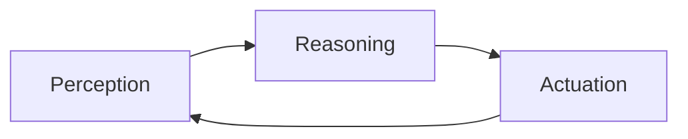

## Summary

This chapter provides an introduction to the field of Physical AI, which combines the disciplines of robotics, machine learning, and embodied cognition to create intelligent systems that can interact with the physical world. It covers the core concepts, architectures, and applications of Physical AI, equipping students with a solid foundation for understanding and designing intelligent robotic systems. Through practical code examples and system diagrams, students will learn how to implement foundational Physical AI techniques in the context of a ROS 2 framework.

## Learning Objectives

By the end of this chapter, students will be able to:

- Explain the key principles and objectives of Physical AI
- Implement a ROS 2 node that utilizes sensor data to make decisions about physical actions
- Analyze the architectural components of a typical Physical AI system
- Evaluate the role of embodied cognition in the development of intelligent robotic systems
- Create a simple Physical AI application that demonstrates the integration of perception, reasoning, and actuation

## Prerequisites

- Familiarity with Python programming
- Basic understanding of robotics and control systems
- Introductory knowledge of machine learning concepts

## Introduction to Physical AI

Physical AI is an emerging field that combines the disciplines of robotics, machine learning, and embodied cognition to create intelligent systems capable of interacting with the physical world. Unlike traditional AI systems that operate primarily in the digital realm, Physical AI systems are designed to perceive, reason about, and act upon the physical environment around them.

At the core of Physical AI is the concept of embodied intelligence, where the agent's cognitive processes are tightly coupled with its physical embodiment. This means that the agent's perceptual and motor capabilities, as well as its physical constraints, play a fundamental role in shaping its intelligence and decision-making.

:::tip
Physical AI systems are not limited to humanoid robots; they can take many forms, including wheeled robots, drones, and even smart home devices.
:::

### Key Principles of Physical AI

The development of Physical AI systems is guided by several key principles:

1. **Embodied Cognition**: The agent's cognitive processes are shaped by its physical embodiment, including its sensors, actuators, and the environment in which it operates.
2. **Real-time Interaction**: Physical AI systems must be able to perceive, reason about, and act upon the physical world in real-time, responding to dynamic and unpredictable environments.
3. **Adaptive and Autonomous Behavior**: Physical AI systems should be able to adapt to new situations, learn from experience, and make autonomous decisions without constant human supervision.
4. **Multimodal Perception**: Physical AI systems should integrate data from a variety of sensors, such as cameras, LiDAR, and force sensors, to build a comprehensive understanding of their surroundings.
5. **Tight Perception-Action Loop**: The agent's perception and action capabilities should be tightly coupled, allowing for seamless interaction with the physical world.

### Physical AI System Architecture

A typical Physical AI system architecture consists of the following key components:

1. **Perception**: The system's sensors, such as cameras, LiDAR, and force sensors, gather information about the physical environment.
2. **Reasoning**: Machine learning models, such as neural networks or Bayesian filters, process the sensor data to make decisions about the agent's actions.
3. **Actuation**: The system's motors and actuators translate the decisions made by the reasoning module into physical actions, such as moving, grasping, or manipulating objects.
4. **Control**: A feedback loop that continuously monitors the system's performance and adjusts the actuation accordingly to achieve the desired behavior.



## Implementing a Physical AI System in ROS 2

To demonstrate the principles of Physical AI, let's consider a simple example of a mobile robot that navigates through an indoor environment while avoiding obstacles. We'll use the Robot Operating System (ROS) 2 framework to implement this system.

### Perception: Obstacle Detection

The first step is to set up a ROS 2 node that can detect obstacles in the robot's environment using a distance sensor, such as a LiDAR or ultrasonic sensor. Here's an example of a Python script that publishes the sensor data to a ROS 2 topic:

```python
import rclpy
from rclpy.node import Node
from sensor_msgs.msg import LaserScan

class ObstacleDetector(Node):
    def __init__(self):
        super().__init__('obstacle_detector')
        self.publisher_ = self.create_publisher(LaserScan, 'obstacle_scan', 10)
        self.timer = self.create_timer(0.1, self.publish_scan)
        self.scan_msg = LaserScan()
        self.scan_msg.header.frame_id = 'laser'
        self.scan_msg.angle_min = -3.14
        self.scan_msg.angle_max = 3.14
        self.scan_msg.angle_increment = 0.01
        self.scan_msg.range_min = 0.1
        self.scan_msg.range_max = 10.0

    def publish_scan(self):
        # Simulate sensor data
        self.scan_msg.ranges = [5.0] * len(self.scan_msg.ranges)
        self.publisher_.publish(self.scan_msg)

def main(args=None):
    rclpy.init(args=args)
    obstacle_detector = ObstacleDetector()
    rclpy.spin(obstacle_detector)
    obstacle_detector.destroy_node()
    rclpy.shutdown()

if __name__ == '__main__':
    main()
```

This script creates a ROS 2 node that publishes simulated LiDAR scan data to the `obstacle_scan` topic at a rate of 10 Hz.

### Reasoning: Obstacle Avoidance

Next, we'll create a ROS 2 node that subscribes to the `obstacle_scan` topic and uses the sensor data to make decisions about the robot's navigation:

```python
import rclpy
from rclpy.node import Node
from sensor_msgs.msg import LaserScan
from geometry_msgs.msg import Twist

class ObstacleAvoidance(Node):
    def __init__(self):
        super().__init__('obstacle_avoidance')
        self.subscription = self.create_subscription(
            LaserScan, 'obstacle_scan', self.scan_callback, 10)
        self.publisher_ = self.create_publisher(Twist, 'cmd_vel', 10)
        self.timer = self.create_timer(0.1, self.control_loop)

    def scan_callback(self, msg):
        self.scan_data = msg.ranges

    def control_loop(self):
        twist = Twist()
        # Analyze the scan data and determine the appropriate linear and angular velocities
        if min(self.scan_data) < 1.0:
            twist.linear.x = 0.0
            twist.angular.z = 0.5
        else:
            twist.linear.x = 0.5
            twist.angular.z = 0.0
        self.publisher_.publish(twist)

def main(args=None):
    rclpy.init(args=args)
    obstacle_avoidance = ObstacleAvoidance()
    rclpy.spin(obstacle_avoidance)
    obstacle_avoidance.destroy_node()
    rclpy.shutdown()

if __name__ == '__main__':
    main()
```

This script creates a ROS 2 node that subscribes to the `obstacle_scan` topic, analyzes the sensor data, and publishes velocity commands to the `cmd_vel` topic to control the robot's movement. If an obstacle is detected within 1 meter, the robot will turn to avoid it; otherwise, it will move forward.

### Actuation: Robot Movement

Finally, we'll need a ROS 2 node that subscribes to the `cmd_vel` topic and translates the velocity commands into physical actions by controlling the robot's motors:

```python
import rclpy
from rclpy.node import Node
from geometry_msgs.msg import Twist
from std_msgs.msg import Float64

class RobotController(Node):
    def __init__(self):
        super().__init__('robot_controller')
        self.subscription = self.create_subscription(
            Twist, 'cmd_vel', self.velocity_callback, 10)
        self.left_wheel_publisher = self.create_publisher(Float64, 'left_wheel_velocity', 10)
        self.right_wheel_publisher = self.create_publisher(Float64, 'right_wheel_velocity', 10)

    def velocity_callback(self, msg):
        left_wheel_velocity = msg.linear.x - 0.5 * msg.angular.z
        right_wheel_velocity = msg.linear.x + 0.5 * msg.angular.z
        self.left_wheel_publisher.publish(Float64(data=left_wheel_velocity))
        self.right_wheel_publisher.publish(Float64(data=right_wheel_velocity))

def main(args=None):
    rclpy.init(args=args)
    robot_controller = RobotController()
    rclpy.spin(robot_controller)
    robot_controller.destroy_node()
    rclpy.shutdown()

if __name__ == '__main__':
    main()
```

This script creates a ROS 2 node that subscribes to the `cmd_vel` topic, calculates the appropriate left and right wheel velocities based on the linear and angular velocity commands, and publishes these values to the `left_wheel_velocity` and `right_wheel_velocity` topics, respectively.

## Key Takeaways

- Physical AI combines robotics, machine learning, and embodied cognition to create intelligent systems that can interact with the physical world.
- Key principles of Physical AI include embodied cognition, real-time interaction, adaptive and autonomous behavior, multimodal perception, and a tight perception-action loop.
- A typical Physical AI system architecture consists of perception, reasoning, actuation, and control components.
- Implementing a Physical AI system in ROS 2 involves creating nodes for sensor data acquisition, decision-making, and motor control.

## Glossary

1. **Embodied Cognition**: The theory that an agent's cognitive processes are shaped by its physical embodiment and interaction with the environment.
2. **Multimodal Perception**: The integration of data from multiple sensors, such as cameras, LiDAR, and force sensors, to build a comprehensive understanding of the agent's surroundings.
3. **Perception-Action Loop**: The tight coupling between an agent's perception of its environment and the actions it takes in response.
4. **ROS 2**: The Robot Operating System, a popular open-source framework for developing robotic applications.
5. **Sensor Fusion**: The process of combining data from multiple sensors to improve the accuracy and reliability of perception.

## Review Questions

1. Explain the key principles of Physical AI and how they differ from traditional AI systems.
2. Describe the main architectural components of a Physical AI system and how they work together.
3. Implement a ROS 2 node that uses sensor data to make decisions about the movement of a mobile robot.