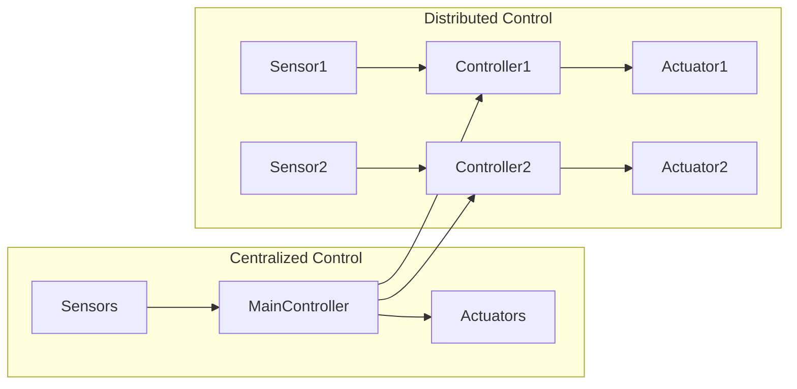

## Summary

This chapter delves into the fundamental hardware components that make up a robot, including sensors, actuators, and control systems. We'll explore the various types of sensors used for perception, the different actuation mechanisms for motion and manipulation, and the control architectures that tie these systems together. Through practical examples and system diagrams, you'll gain a comprehensive understanding of how robot hardware enables physical AI applications in the real world.

## Learning Objectives

By the end of this chapter, you will be able to:

- Explain the role and functionality of common robot sensors, such as encoders, IMUs, and vision systems
- Implement a ROS 2 node that subscribes to sensor data and publishes state estimates
- Analyze the trade-offs between different actuation methods, including electric motors, hydraulics, and pneumatics
- Evaluate the advantages and limitations of centralized versus distributed control architectures for robotic systems
- Create a high-level system diagram depicting the integration of sensors, actuators, and a control system in a robotic platform

## Prerequisites

- Familiarity with the fundamentals of robotics and physical AI
- Basic understanding of ROS 2 and Python programming

## Robot Hardware: Sensors, Actuators, and Control Systems

### Sensors for Robot Perception

Robots rely on a variety of sensors to perceive their environment and internal state. Some of the most common sensor types include:

- **Encoders**: Measure the position and velocity of rotary joints or wheels, enabling precise control of motion.
- **Inertial Measurement Units (IMUs)**: Provide information about the robot's orientation, acceleration, and angular velocity, crucial for stabilization and navigation.
- **Vision Systems**: Cameras and computer vision algorithms enable robots to detect and recognize objects, people, and obstacles in their surroundings.
- **Force/Torque Sensors**: Measure the forces and torques applied to a robot's end-effector, enabling force-controlled manipulation tasks.
- **Proximity/Distance Sensors**: Detect the presence and distance of nearby objects, supporting collision avoidance and mapping.

:::note ROS 2 Example
Here's an example of a ROS 2 node that subscribes to sensor data and publishes state estimates:

```python
import rclpy
from rclpy.node import Node
from sensor_msgs.msg import JointState, Imu
from nav_msgs.msg import Odometry

class RobotStateEstimator(Node):
    def __init__(self):
        super().__init__('robot_state_estimator')
        self.joint_state_sub = self.create_subscription(JointState, 'joint_states', self.joint_state_callback, 10)
        self.imu_sub = self.create_subscription(Imu, 'imu', self.imu_callback, 10)
        self.odom_pub = self.create_publisher(Odometry, 'odometry', 10)

    def joint_state_callback(self, msg):
        # Process joint state data to estimate robot pose
        pose = self.estimate_pose(msg.position)
        self.publish_odometry(pose)

    def imu_callback(self, msg):
        # Process IMU data to estimate robot orientation and velocity
        orientation, velocity = self.estimate_state(msg)
        self.publish_odometry(orientation, velocity)

    def publish_odometry(self, pose, twist):
        odom_msg = Odometry()
        odom_msg.pose.pose.position.x = pose.x
        odom_msg.pose.pose.orientation.w = pose.w
        odom_msg.twist.twist.linear.x = twist.linear.x
        self.odom_pub.publish(odom_msg)

def main(args=None):
    rclpy.init(args=args)
    node = RobotStateEstimator()
    rclpy.spin(node)
    rclpy.shutdown()

if __name__ == '__main__':
    main()
```
:::

### Actuators for Robot Motion and Manipulation

Robots use a variety of actuators to generate the necessary forces and torques for movement and manipulation. Common actuation methods include:

- **Electric Motors**: Brushed, brushless, and stepper motors are widely used for joint and wheel actuation due to their precision, efficiency, and controllability.
- **Hydraulic Actuators**: Provide high power-to-weight ratios and can generate large forces, making them suitable for heavy-duty applications like construction and industrial robotics.
- **Pneumatic Actuators**: Use compressed air to generate motion, offering a simpler and more cost-effective solution for certain applications, such as grippers and soft robotics.

The choice of actuator depends on factors such as the required force, speed, power, and size constraints of the robotic system.

### Control Systems for Integrated Functionality

Robot control systems are responsible for coordinating the various sensors and actuators to achieve the desired behavior. There are two main architectural approaches:

1. **Centralized Control**: A single, powerful computer or microcontroller manages all sensor inputs, calculates the appropriate control outputs, and sends commands to the actuators.
2. **Distributed Control**: Multiple, interconnected microcontrollers or embedded systems are responsible for specific subsystems, with a higher-level controller coordinating their operation.

:::info Mermaid Diagram

The choice between centralized and distributed control depends on factors such as system complexity, real-time requirements, and fault tolerance.
:::

## Key Takeaways

- Robots use a variety of sensors, including encoders, IMUs, and vision systems, to perceive their environment and internal state.
- Actuators, such as electric motors, hydraulics, and pneumatics, provide the necessary forces and torques for robot motion and manipulation.
- Robot control systems can be centralized or distributed, with trade-offs in terms of complexity, real-time performance, and fault tolerance.
- Integrating sensors, actuators, and control systems is crucial for enabling physical AI applications in the real world.

## Glossary

- **Encoder**: A sensor that measures the position and/or velocity of a rotating shaft or wheel.
- **Inertial Measurement Unit (IMU)**: A sensor that measures a robot's orientation, acceleration, and angular velocity.
- **End-effector**: The part of a robot that interacts with the environment, such as a gripper or tool.
- **Centralized Control**: A control architecture where a single, powerful computer manages all sensor inputs and actuator outputs.
- **Distributed Control**: A control architecture where multiple, interconnected microcontrollers or embedded systems are responsible for specific subsystems.
- **Fault Tolerance**: The ability of a system to continue operating in the event of a component failure.

## Review Questions

1. Explain the role and functionality of two different types of sensors commonly used in robotics.
2. Implement a ROS 2 node that subscribes to sensor data and publishes state estimates for a robot.
3. Analyze the trade-offs between electric motors, hydraulic actuators, and pneumatic actuators for a robotic manipulator application.
4. Evaluate the advantages and limitations of a centralized versus a distributed control architecture for a complex robotic system.
5. Create a high-level system diagram depicting the integration of sensors, actuators, and a control system in a mobile robot platform.