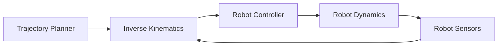

## Summary

This chapter delves into the essential mathematical foundations of linear algebra and calculus that are crucial for understanding and implementing robot motion and control. We'll cover key concepts such as vectors, matrices, transformations, differentiation, and integration, and explore how these mathematical tools are applied in the context of robotic systems. Through practical examples and hands-on exercises, you'll gain a solid grasp of the mathematical principles that enable robots to navigate, interact with their environment, and execute complex tasks.

## Learning Objectives

By the end of this chapter, you will be able to:

- Explain the role of linear algebra in representing and transforming robot poses and orientations
- Implement matrix-based operations for robot kinematics and dynamics in Python/ROS 2
- Analyze the use of calculus to model and control robot motion, including velocity, acceleration, and trajectory planning
- Evaluate the application of linear algebra and calculus in the design and implementation of robotic control systems
- Create a ROS 2 node that performs forward and inverse kinematics calculations for a simple robotic manipulator

## Prerequisites

- Familiarity with basic programming concepts in Python
- Understanding of the fundamentals of robotics and robot motion

## Main Content

### 1. Introduction to Linear Algebra for Robotics

#### 1.1. Vectors and Matrices
- Defining vectors and matrices
- Vector operations: addition, subtraction, scalar multiplication
- Matrix operations: addition, subtraction, multiplication, transposition

#### 1.2. Coordinate Frames and Transformations
- Representing robot poses and orientations using homogeneous transformation matrices
- Applying transformations to map between different coordinate frames

#### 1.3. Kinematics and Jacobians
- Forward and inverse kinematics
- Calculating the Jacobian matrix for a robotic manipulator
- Using the Jacobian for velocity and force/torque analysis

### 2. Calculus for Robot Motion

#### 2.1. Differentiation and Integration
- Interpreting the meaning of derivatives and integrals in the context of robot motion
- Calculating velocities and accelerations from position data

#### 2.2. Trajectory Planning
- Defining smooth trajectories using polynomial functions
- Implementing time-optimal and minimum-jerk trajectory planning algorithms

#### 2.3. Feedback Control and Dynamics
- Modeling robot dynamics using Lagrangian and Newton-Euler formulations
- Designing feedback control systems for robot motion control

### 3. Practical Applications

#### 3.1. ROS 2 Example: Forward and Inverse Kinematics
```python
import numpy as np
import rclpy
from rclpy.node import Node
from geometry_msgs.msg import Pose

class KinematicsNode(Node):
    def __init__(self):
        super().__init__('kinematics_node')
        self.pose_pub = self.create_publisher(Pose, 'robot_pose', 10)
        self.timer = self.create_timer(0.1, self.publish_pose)

        # Define your robot's kinematic parameters here
        self.link_lengths = [0.5, 0.3, 0.2]

    def forward_kinematics(self, joint_angles):
        # Implement forward kinematics calculations here
        # Return the end-effector pose as a Pose message
        pass

    def inverse_kinematics(self, desired_pose):
        # Implement inverse kinematics calculations here
        # Return the joint angles as a numpy array
        pass

    def publish_pose(self):
        # Example joint angles
        joint_angles = np.array([0.5, 1.0, -0.7])
        pose = self.forward_kinematics(joint_angles)
        self.pose_pub.publish(pose)

def main(args=None):
    rclpy.init(args=args)
    node = KinematicsNode()
    rclpy.spin(node)
    rclpy.shutdown()

if __name__ == '__main__':
    main()

#### 3.2. Mermaid Diagram: Robot Control System Architecture


```

## Key Takeaways

- Linear algebra provides the mathematical foundation for representing and transforming robot poses and orientations.
- Calculus is essential for modeling and controlling robot motion, including velocity, acceleration, and trajectory planning.
- The Jacobian matrix is a crucial tool for analyzing the kinematics and dynamics of robotic manipulators.
- Feedback control systems, based on robot dynamics, are used to achieve precise motion control.
- Practical implementation of robot motion control requires the integration of linear algebra, calculus, and control theory.

## Glossary

1. **Vector**: A mathematical object that represents a quantity with both magnitude and direction.
2. **Matrix**: A two-dimensional array of numbers, symbols, or expressions, arranged in rows and columns.
3. **Homogeneous Transformation Matrix**: A 4x4 matrix that represents the position and orientation of a coordinate frame relative to another frame.
4. **Jacobian Matrix**: A matrix that represents the relationship between the joint velocities and the end-effector's linear and angular velocities.
5. **Trajectory Planning**: The process of generating smooth and feasible robot motion trajectories based on desired start and end positions, velocities, and accelerations.
6. **Lagrangian Formulation**: A method for deriving the equations of motion for a robotic system based on the system's kinetic and potential energies.
7. **Newton-Euler Formulation**: A method for deriving the equations of motion for a robotic system based on the application of Newton's and Euler's laws of motion.

## Review Questions

1. Explain the role of homogeneous transformation matrices in representing robot poses and orientations.
2. Implement a Python/ROS 2 function that calculates the Jacobian matrix for a 3-DOF robotic manipulator.
3. Describe the process of designing a feedback control system for a robot's motion control, including the use of calculus-based concepts.
4. Evaluate the trade-offs between time-optimal and minimum-jerk trajectory planning algorithms for a robotic system.
5. Analyze the integration of linear algebra, calculus, and control theory in the design and implementation of a robot control system.