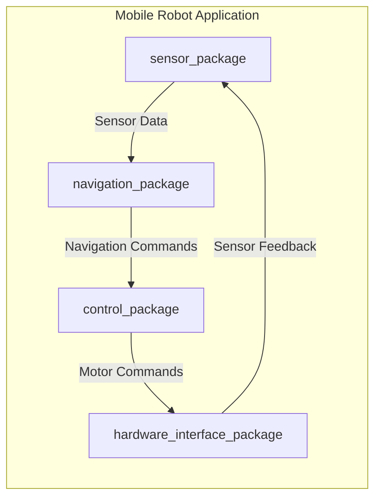

## Summary

This chapter delves into the process of building robot applications using ROS (Robot Operating System) packages. ROS is a powerful open-source framework that enables the development of complex robotic systems through a modular, distributed architecture. In this chapter, you will learn how to create, customize, and integrate ROS packages to construct versatile and scalable robot applications. You will explore the structure and components of ROS packages, understand the ROS build system, and gain hands-on experience in developing and deploying ROS-based robot applications.

## Learning Objectives

By the end of this chapter, you will be able to:

- Explain the key components and structure of a ROS package
- Implement a custom ROS package with publisher and subscriber nodes
- Analyze the ROS build system and use catkin to build and deploy ROS packages
- Evaluate the integration of multiple ROS packages to create a comprehensive robot application
- Design a modular ROS-based system architecture for a complex robot application

## Prerequisites

- Familiarity with the ROS 2 framework and its core concepts, as covered in previous chapters
- Basic understanding of Python programming and its application in ROS
- Experience with version control systems, such as Git, for managing ROS package development

## Main Content

### Understanding ROS Packages

ROS packages are the fundamental building blocks of ROS-based robot applications. A ROS package is a directory structure that contains all the necessary files and resources required to implement a specific functionality or component of a robotic system. Packages can include code, configuration files, launch scripts, and various other assets. Understanding the structure and components of ROS packages is crucial for effectively building and integrating them into your robot applications.

#### ROS Package Structure

A typical ROS package directory structure includes the following key elements:

- `package.xml`: This XML file contains metadata about the package, such as its name, version, description, and dependencies.
- `CMakeLists.txt`: This file is used by the ROS build system (catkin) to manage the compilation and installation of the package.
- `src/`: This directory holds the source code files for the package, typically written in C++ or Python.
- `include/`: This directory contains any header files or other include files used by the package's source code.
- `launch/`: This directory stores launch files, which are used to start and configure the ROS nodes that make up the package.
- `config/`: This directory holds any configuration files, such as parameter files, used by the package.
- `scripts/`: This directory contains any executable scripts, such as Python scripts, that are part of the package.

:::tip
The specific structure of a ROS package may vary depending on the package's requirements, but the elements mentioned above are common across most ROS packages.
:::

#### Creating a Custom ROS Package

To create a new ROS package, you can use the `ros2 pkg create` command. This command generates the necessary directory structure and files for a new package. For example, to create a package named `my_robot_package`, you would run the following command:

```bash
ros2 pkg create my_robot_package --build-type ament_python --dependencies rclpy
```

This command creates a new ROS package named `my_robot_package` with the `ament_python` build type and the `rclpy` dependency.

### Developing ROS Nodes and Publishers/Subscribers

Within a ROS package, you can create ROS nodes that implement specific functionalities. These nodes can communicate with each other using the ROS publisher/subscriber model. Let's look at an example of creating a simple publisher and subscriber node in Python:

```python
# my_robot_package/my_robot_package/publisher_node.py
import rclpy
from rclpy.node import Node
from std_msgs.msg import String

class PublisherNode(Node):
    def __init__(self):
        super().__init__('publisher_node')
        self.publisher_ = self.create_publisher(String, 'topic', 10)
        self.timer = self.create_timer(0.5, self.timer_callback)

    def timer_callback(self):
        msg = String()
        msg.data = 'Hello from the publisher!'
        self.publisher_.publish(msg)
        self.get_logger().info('Published: "%s"' % msg.data)

def main(args=None):
    rclpy.init(args=args)
    node = PublisherNode()
    rclpy.spin(node)
    node.destroy_node()
    rclpy.shutdown()
```

```python
# my_robot_package/my_robot_package/subscriber_node.py
import rclpy
from rclpy.node import Node
from std_msgs.msg import String

class SubscriberNode(Node):
    def __init__(self):
        super().__init__('subscriber_node')
        self.subscription = self.create_subscription(
            String,
            'topic',
            self.listener_callback,
            10)
        self.subscription  # prevent unused variable warning

    def listener_callback(self, msg):
        self.get_logger().info('I heard: "%s"' % msg.data)

def main(args=None):
    rclpy.init(args=args)
    node = SubscriberNode()
    rclpy.spin(node)
    node.destroy_node()
    rclpy.shutdown()
```

In this example, the `PublisherNode` creates a publisher that sends `String` messages to the `'topic'` topic every 0.5 seconds. The `SubscriberNode` creates a subscriber that listens for messages on the `'topic'` topic and logs the received messages.

### The ROS Build System: Catkin

ROS uses the `catkin` build system to manage the compilation and installation of ROS packages. The `catkin` build system is responsible for resolving dependencies, compiling source code, and creating installable packages.

The main steps in the `catkin` build process are:

1. **Catkin Workspace Setup**: Create a `catkin` workspace directory and initialize it with the `catkin init` command.
2. **Package Development**: Develop your ROS packages within the `catkin` workspace, following the package structure guidelines.
3. **Catkin Build**: Use the `catkin build` command to build the packages in your `catkin` workspace.
4. **Package Installation**: Install the built packages using the `catkin install` command.

:::note
The `catkin` build system is used in ROS 1, while ROS 2 uses the `ament` build system, which has a similar structure and functionality.
:::

### Integrating ROS Packages

One of the key benefits of ROS is its modular architecture, which allows you to easily integrate multiple ROS packages to create a comprehensive robot application. By leveraging the publisher/subscriber communication model and the ROS launch system, you can seamlessly combine different packages to build complex robotic systems.

Here's an example of how you might integrate multiple ROS packages using a launch file:

```xml
<!-- my_robot_package/launch/my_robot_app.launch.py -->
from launch import LaunchDescription
from launch_ros.actions import Node

def generate_launch_description():
    return LaunchDescription([
        Node(
            package='my_robot_package',
            executable='publisher_node',
            name='publisher_node'
        ),
        Node(
            package='another_package',
            executable='subscriber_node',
            name='subscriber_node'
        )
    ])
```

In this example, the launch file integrates the `publisher_node` from the `my_robot_package` package and the `subscriber_node` from the `another_package` package, allowing them to communicate with each other through the ROS topic system.

### Designing Modular ROS Architectures

When building complex robot applications, it's important to design a modular and scalable ROS-based system architecture. This involves breaking down the overall system into smaller, reusable components (ROS packages) that can be easily integrated and maintained.

Here's an example of a modular ROS-based system architecture for a mobile robot application:



In this architecture, the robot application is composed of several ROS packages, each responsible for a specific functionality:

- `sensor_package`: Handles sensor data acquisition and preprocessing
- `navigation_package`: Implements navigation algorithms and decision-making
- `control_package`: Translates navigation commands into motor commands
- `hardware_interface_package`: Provides an abstraction layer for interacting with the robot's hardware

By designing a modular architecture like this, you can easily swap out or update individual components of the robot application without affecting the overall system.

## Key Takeaways

- ROS packages are the fundamental building blocks of ROS-based robot applications, providing a structured and modular way to develop and integrate robotic components.
- Creating custom ROS packages involves understanding the package structure, including the `package.xml`, `CMakeLists.txt`, and various directories for source code, configuration, and launch files.
- Developing ROS nodes and implementing the publisher/subscriber communication model is a core aspect of building ROS-based applications.
- The `catkin` build system in ROS 1 (and the `ament` build system in ROS 2) is responsible for managing the compilation and installation of ROS packages.
- Integrating multiple ROS packages to create a comprehensive robot application leverages the modular and distributed architecture of ROS, allowing for scalable and maintainable systems.
- Designing a modular ROS-based system architecture is crucial for building complex robot applications that can be easily extended and updated over time.

## Glossary

- **ROS Package**: A directory structure that contains the necessary files and resources to implement a specific functionality or component of a robotic system.
- **ROS Node**: A process that performs a specific task or functionality within a ROS-based system.
- **Publisher/Subscriber Model**: A communication pattern in ROS where nodes can publish messages to a topic, and other nodes can subscribe to that topic to receive the messages.
- **Catkin**: The build system used in ROS 1 to manage the compilation and installation of ROS packages.
- **Ament**: The build system used in ROS 2, which serves a similar purpose to Catkin in ROS 1.
- **ROS Launch**: A system in ROS that allows you to start multiple ROS nodes and configure their parameters in a coordinated manner.
- **Modular Architecture**: A design approach in which a system is composed of smaller, reusable components that can be easily integrated and maintained.

## Review Questions

1. Explain the key components of a ROS package and their purpose.
2. Implement a custom ROS package with a publisher node that sends sensor data and a subscriber node that receives and logs the data.
3. Describe the main steps involved in the Catkin build process and how it is used to manage the compilation and installation of ROS packages.
4. Analyze the benefits of a modular ROS-based system architecture and provide an example of how you would design such an architecture for a mobile robot application.
5. Evaluate the importance of integrating multiple ROS packages to create a comprehensive robot application and discuss the challenges and strategies involved in this process.