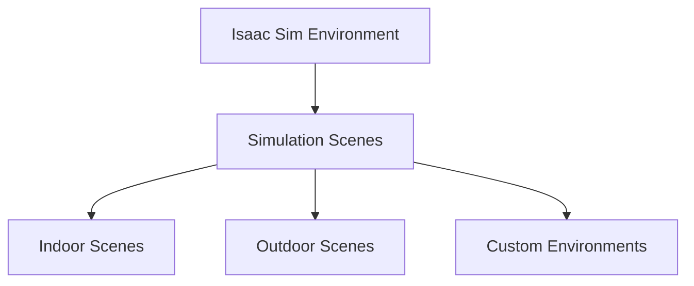
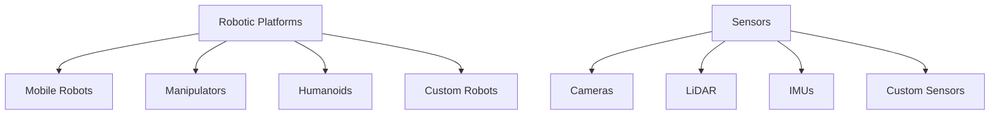
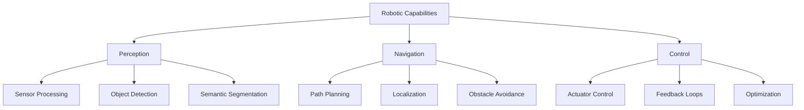

## Summary

This chapter delves into the setup and fundamental concepts of the NVIDIA Isaac Sim, a powerful robotics simulation platform. It covers the installation process, key features, and core components of the Isaac Sim, enabling you to create and simulate complex robotic systems. Through practical examples and hands-on exercises, you will learn how to leverage the Isaac Sim's advanced capabilities for perception, navigation, and control, laying the foundation for developing cutting-edge robotic applications.

## Learning Objectives

By the end of this chapter, you will be able to:

- Explain the key features and components of the NVIDIA Isaac Sim
- Implement a basic robotic simulation in the Isaac Sim using Python and ROS 2
- Analyze the sensor data and control inputs within the Isaac Sim environment
- Evaluate the performance of a robot's navigation and control algorithms in the Isaac Sim
- Create a custom robot model and integrate it into the Isaac Sim for testing and validation

## Prerequisites

- Familiarity with robotics concepts, including sensors, actuators, and control systems
- Basic understanding of Python programming and ROS 2 framework
- Exposure to robot simulation environments (e.g., Gazebo, V-REP)

## Main Content

### 1. Introduction to NVIDIA Isaac Sim

NVIDIA Isaac Sim is a powerful robotics simulation platform that allows you to create, test, and validate complex robotic systems in a realistic virtual environment. Developed by NVIDIA, the Isaac Sim leverages the company's expertise in graphics, simulation, and AI to provide a comprehensive solution for robotics engineers and researchers.

#### 1.1. Key Features of Isaac Sim
- Photorealistic rendering and physics-based simulation
- Support for a wide range of sensors, including cameras, LiDAR, and IMUs
- Integration with ROS 2 and other popular robotics frameworks
- Scalable and GPU-accelerated simulation for faster testing and validation
- Extensible architecture for adding custom robots, environments, and plugins

### 2. Setting Up the Isaac Sim

To get started with the Isaac Sim, you will need to download and install the necessary software. The Isaac Sim is available for Windows and Linux operating systems, and the installation process varies depending on your platform.

#### 2.1. Installing the Isaac Sim
1. Visit the NVIDIA Isaac Sim website and download the appropriate version for your operating system.
2. Follow the installation instructions provided by NVIDIA, which may include setting up dependencies and configuring your development environment.
3. Verify the installation by launching the Isaac Sim and ensuring that the default robotic simulation is running correctly.

#### 2.2. Integrating with ROS 2
The Isaac Sim provides seamless integration with the Robot Operating System (ROS) 2 framework, allowing you to leverage existing ROS 2 packages and tools within the simulation.

```python
# Example: Connecting the Isaac Sim to ROS 2
import rclpy
from rclpy.node import Node
from sensor_msgs.msg import Image

class IsaacSimNode(Node):
    def __init__(self):
        super().__init__('isaac_sim_node')
        self.camera_subscriber = self.create_subscription(
            Image, 'camera/image_raw', self.camera_callback, 10)

    def camera_callback(self, msg):
        self.get_logger().info('Received camera image')

def main(args=None):
    rclpy.init(args=args)
    node = IsaacSimNode()
    rclpy.spin(node)
    rclpy.shutdown()

if __name__ == '__main__':
    main()

### 3. Exploring the Isaac Sim Environment

The Isaac Sim provides a comprehensive environment for designing, testing, and validating robotic systems. Let's explore the key components and features of the Isaac Sim.

#### 3.1. Simulation Scenes and Environments
The Isaac Sim comes with a variety of pre-built simulation scenes and environments, ranging from indoor office spaces to outdoor urban settings. You can also create and customize your own environments to suit your specific needs.



#### 3.2. Robotic Platforms and Sensors
The Isaac Sim supports a wide range of robotic platforms, including mobile robots, manipulators, and humanoids. It also provides a vast library of sensors, such as cameras, LiDAR, and IMUs, which can be easily integrated into your robotic simulations.



#### 3.3. Perception, Navigation, and Control
The Isaac Sim enables you to develop and test advanced perception, navigation, and control algorithms for your robotic systems. It provides a range of tools and APIs for integrating these capabilities into your simulations.



### 4. Developing and Simulating Robotic Systems

In this section, you will learn how to create and simulate robotic systems within the Isaac Sim, leveraging the platform's advanced features and capabilities.

#### 4.1. Creating a Robotic Simulation
1. Launch the Isaac Sim and select a suitable simulation scene or environment.
2. Add a robotic platform (e.g., mobile robot, manipulator) to the scene.
3. Configure the robot's sensors and actuators, and integrate them with the simulation.
4. Implement the perception, navigation, and control algorithms for your robotic system.
5. Run the simulation and observe the robot's behavior, performance, and interaction with the environment.

```python
# Example: Controlling a robot in the Isaac Sim using ROS 2
import rclpy
from rclpy.node import Node
from geometry_msgs.msg import Twist

class RobotController(Node):
    def __init__(self):
        super().__init__('robot_controller')
        self.cmd_vel_publisher = self.create_publisher(Twist, 'cmd_vel', 10)
        self.timer = self.create_timer(0.1, self.publish_cmd_vel)

    def publish_cmd_vel(self):
        twist = Twist()
        twist.linear.x = 0.5  # Set the desired linear velocity
        twist.angular.z = 0.2  # Set the desired angular velocity
        self.cmd_vel_publisher.publish(twist)

def main(args=None):
    rclpy.init(args=args)
    node = RobotController()
    rclpy.spin(node)
    rclpy.shutdown()

if __name__ == '__main__':
    main()
```

#### 4.2. Validating Robotic Algorithms
The Isaac Sim allows you to rigorously test and validate your robotic algorithms, such as perception, navigation, and control, in a realistic and controlled environment.

1. Implement your algorithms and integrate them into the Isaac Sim.
2. Run the simulation and observe the robot's behavior, performance, and interaction with the environment.
3. Collect and analyze sensor data, control inputs, and other relevant metrics to evaluate the effectiveness of your algorithms.
4. Iterate on your algorithms and repeat the simulation and validation process until you achieve the desired performance.

### Key Takeaways

- NVIDIA Isaac Sim is a powerful robotics simulation platform that enables the creation, testing, and validation of complex robotic systems.
- The Isaac Sim provides a range of features, including photorealistic rendering, physics-based simulation, and support for a wide variety of sensors and robotic platforms.
- Integrating the Isaac Sim with ROS 2 allows you to leverage existing robotics frameworks and tools within the simulation.
- The Isaac Sim environment offers a variety of pre-built simulation scenes and the ability to create custom environments for your robotic applications.
- You can develop and test advanced perception, navigation, and control algorithms within the Isaac Sim, validating their performance in a realistic virtual setting.

### Glossary

1. **NVIDIA Isaac Sim**: A powerful robotics simulation platform developed by NVIDIA, which provides a comprehensive environment for creating, testing, and validating complex robotic systems.
2. **Photorealistic Rendering**: The ability of a simulation platform to generate highly realistic and visually appealing 3D graphics, closely resembling the real world.
3. **Physics-based Simulation**: A simulation approach that accurately models the physical properties and interactions of objects, such as gravity, friction, and collisions.
4. **ROS 2 (Robot Operating System 2)**: A popular open-source framework for building and deploying robotic applications, which provides a set of tools and libraries for developing, testing, and deploying robotic systems.
5. **Sensor Integration**: The process of incorporating various sensors, such as cameras, LiDAR, and IMUs, into a robotic system to enable perception and environmental awareness.
6. **Perception, Navigation, and Control**: The core capabilities of a robotic system, including the ability to perceive the environment, plan and execute navigation tasks, and control the robot's movements and actions.
7. **Simulation Validation**: The process of testing and evaluating the performance of robotic algorithms and systems within a simulated environment, to ensure their effectiveness and reliability before deployment in the real world.

### Review Questions

1. Explain the key features and components of the NVIDIA Isaac Sim.
2. Implement a basic robotic simulation in the Isaac Sim using Python and ROS 2, including the integration of sensor data and control inputs.
3. Analyze the performance of a robot's navigation and control algorithms within the Isaac Sim environment, and discuss the benefits of validating algorithms in a simulated setting.
4. Describe the process of creating a custom robot model and integrating it into the Isaac Sim for testing and validation.
5. Evaluate the advantages of the Isaac Sim's photorealistic rendering and physics-based simulation capabilities for developing and testing robotic systems.