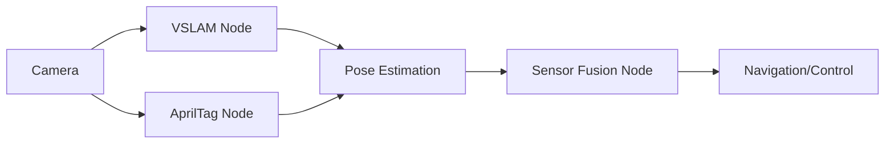

## Summary

This chapter delves into the advanced perception capabilities of the Isaac ROS framework, focusing on two key technologies: Visual SLAM (VSLAM) and AprilTag detection. You will learn how to leverage these powerful tools to enhance the situational awareness and navigation abilities of your robotic systems. Through practical code examples and system architectures, you will gain a deep understanding of how to integrate these perception pipelines into your robotic applications.

## Learning Objectives

By the end of this chapter, you will be able to:

- Explain the key principles and algorithms behind Visual SLAM and AprilTag detection
- Implement a ROS 2 node that utilizes the Isaac ROS VSLAM package to perform real-time 3D mapping and localization
- Analyze the performance and accuracy of the VSLAM system under different environmental conditions
- Evaluate the use of AprilTags for robust pose estimation and fiducial-based navigation
- Create a multi-sensor perception pipeline that fuses VSLAM and AprilTag data for enhanced robustness

## Prerequisites

- Proficiency in Python and ROS 2 programming
- Understanding of basic robotic perception concepts (cameras, sensors, etc.)
- Familiarity with the Isaac ROS framework and its core packages

## Main Content

### Visual SLAM in Isaac ROS

Visual SLAM (Simultaneous Localization and Mapping) is a fundamental technique in robotic perception, allowing a robot to build a 3D map of its environment while simultaneously tracking its own position within that map. The Isaac ROS framework provides a powerful VSLAM package that leverages GPU acceleration and advanced computer vision algorithms to deliver real-time, high-accuracy 3D mapping and localization.

#### VSLAM Principles and Algorithms

At the core of the Isaac ROS VSLAM package is a tightly-coupled optimization-based approach that jointly estimates the robot's pose and the 3D structure of the environment. This is achieved through the fusion of visual features (e.g., corners, edges) extracted from camera images with inertial measurement data from an IMU sensor.

The VSLAM algorithm typically consists of the following key steps:

1. **Feature Extraction**: Identifying salient visual features in the camera images, such as corners, edges, and textures.
2. **Feature Matching**: Establishing correspondences between features across consecutive frames to track their motion.
3. **Pose Estimation**: Calculating the robot's 6-DoF pose (position and orientation) based on the feature correspondences and the known camera parameters.
4. **Map Optimization**: Refining the 3D map of the environment by minimizing the reprojection error of the visual features.

The Isaac ROS VSLAM package leverages GPU acceleration to perform these computationally-intensive tasks in real-time, enabling robust and efficient localization and mapping.

```python
# Example ROS 2 node for Isaac ROS VSLAM
import rclpy
from rclpy.node import Node
from isaac_ros_vslam.vslam_node import VSLAMNode

class MyVSLAMNode(Node):
    def __init__(self):
        super().__init__('my_vslam_node')
        self.vslam_node = VSLAMNode(self)
        self.vslam_node.start()

def main(args=None):
    rclpy.init(args=args)
    node = MyVSLAMNode()
    rclpy.spin(node)
    rclpy.shutdown()

if __name__ == '__main__':
    main()

:::note
The Isaac ROS VSLAM package provides a high-level ROS 2 node that abstracts away the complex VSLAM algorithms, allowing you to easily integrate it into your robotic applications.
:::

#### VSLAM Performance and Evaluation

The performance and accuracy of the VSLAM system can be influenced by various factors, such as the quality and resolution of the camera, the lighting conditions, and the complexity of the environment. It is important to evaluate the VSLAM system under different scenarios to ensure it meets the requirements of your application.

One common metric for evaluating VSLAM performance is the Absolute Trajectory Error (ATE), which measures the difference between the estimated robot trajectory and the ground truth. You can use the ROS 2 `rosbag` tool to record VSLAM data and then analyze the ATE using dedicated evaluation tools.

### AprilTag Detection in Isaac ROS

AprilTags are fiducial markers that can be used for robust pose estimation and localization. The Isaac ROS framework provides a powerful AprilTag detection package that leverages GPU acceleration to enable real-time, high-accuracy detection and pose estimation.

#### AprilTag Principles and Algorithms

AprilTags are square-shaped markers that can be uniquely identified by their internal binary patterns. The AprilTag detection algorithm typically involves the following steps:

1. **Tag Detection**: Identifying the presence of AprilTags in the camera image by detecting the distinctive square patterns.
2. **Pose Estimation**: Calculating the 6-DoF pose (position and orientation) of the detected AprilTags relative to the camera.
3. **Data Association**: Matching the detected AprilTags to their corresponding unique IDs and positions in the environment.

The Isaac ROS AprilTag detection package utilizes GPU-accelerated computer vision algorithms to perform these tasks efficiently and with high accuracy.

```python
# Example ROS 2 node for Isaac ROS AprilTag detection
import rclpy
from rclpy.node import Node
from isaac_ros_apriltag.apriltag_node import AprilTagNode

class MyAprilTagNode(Node):
    def __init__(self):
        super().__init__('my_apriltag_node')
        self.apriltag_node = AprilTagNode(self)
        self.apriltag_node.start()

def main(args=None):
    rclpy.init(args=args)
    node = MyAprilTagNode()
    rclpy.spin(node)
    rclpy.shutdown()

if __name__ == '__main__':
    main()
```

:::note
The Isaac ROS AprilTag detection package provides a high-level ROS 2 node that simplifies the integration of AprilTag-based pose estimation into your robotic applications.
:::

#### Fusing VSLAM and AprilTag Data

To enhance the robustness and accuracy of your robotic perception system, you can combine the VSLAM and AprilTag detection capabilities. By fusing the 3D map and localization data from the VSLAM system with the precise pose information from the AprilTag detections, you can create a multi-sensor perception pipeline that offers improved performance and reliability.



The sensor fusion node can use techniques like Kalman filtering or nonlinear optimization to integrate the VSLAM and AprilTag data, providing a more accurate and reliable estimate of the robot's pose and the surrounding environment.

## Key Takeaways

- The Isaac ROS framework provides powerful VSLAM and AprilTag detection capabilities, leveraging GPU acceleration for real-time performance.
- VSLAM algorithms jointly estimate the robot's pose and the 3D structure of the environment by fusing visual features and inertial data.
- AprilTags are fiducial markers that can be used for robust pose estimation and localization.
- Combining VSLAM and AprilTag data in a multi-sensor perception pipeline can enhance the robustness and accuracy of your robotic system.
- Evaluating the performance of the VSLAM system under different conditions is crucial for ensuring it meets the requirements of your application.

## Glossary

1. **Visual SLAM (VSLAM)**: A technique in robotic perception that allows a robot to build a 3D map of its environment while simultaneously tracking its own position within that map.
2. **AprilTag**: A fiducial marker that can be uniquely identified by its internal binary pattern and used for robust pose estimation and localization.
3. **Sensor Fusion**: The process of integrating data from multiple sensors to provide a more accurate and reliable estimate of the system's state.
4. **Absolute Trajectory Error (ATE)**: A metric used to evaluate the performance of a VSLAM system by measuring the difference between the estimated robot trajectory and the ground truth.
5. **GPU Acceleration**: The use of a graphics processing unit (GPU) to offload computationally-intensive tasks, such as computer vision algorithms, to improve performance.

## Review Questions

1. Explain the key steps involved in the VSLAM algorithm used in the Isaac ROS framework.
2. Implement a ROS 2 node that utilizes the Isaac ROS VSLAM package to perform real-time 3D mapping and localization.
3. Analyze the factors that can influence the performance and accuracy of the VSLAM system, and describe how you would evaluate its performance.
4. Describe the principles and algorithms behind AprilTag detection, and explain how the Isaac ROS framework leverages GPU acceleration to enable real-time, high-accuracy pose estimation.
5. Design a multi-sensor perception pipeline that fuses data from the VSLAM and AprilTag detection systems to enhance the robustness and accuracy of your robotic application.