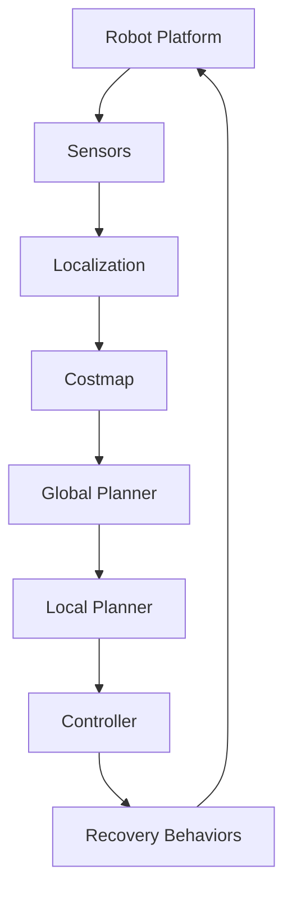

## Summary

This chapter delves into the Nav2 navigation stack, a powerful and flexible framework for mobile robot navigation and control. Developed as part of the Robot Operating System 2 (ROS 2) ecosystem, Nav2 provides a comprehensive set of tools and algorithms to enable advanced navigation capabilities for a wide range of robotic platforms. Through detailed explanations, practical code examples, and system architecture diagrams, you will learn how to leverage the Nav2 stack to implement robust and efficient navigation solutions for your robotic projects.

## Learning Objectives

By the end of this chapter, you will be able to:

- Explain the key components and functionality of the Nav2 navigation stack
- Implement a basic Nav2-based navigation system for a mobile robot platform
- Analyze the performance of the Nav2 stack and tune its parameters for optimal navigation
- Evaluate the use of Nav2 in complex, real-world robotic applications
- Create custom Nav2 plugins to extend the functionality of the navigation stack

## Prerequisites

- Familiarity with ROS 2 and its core concepts (nodes, topics, services, etc.)
- Understanding of basic robot navigation algorithms, such as path planning and localization
- Experience with Python programming and its application in ROS 2 projects

## Main Content

### Introduction to the Nav2 Navigation Stack

The Nav2 navigation stack is a powerful and flexible framework for mobile robot navigation and control, built on top of the Robot Operating System 2 (ROS 2) ecosystem. Developed by the Autonomous Driving Group at Intel, Nav2 provides a comprehensive set of tools and algorithms to enable advanced navigation capabilities for a wide range of robotic platforms, from wheeled robots to legged and aerial vehicles.

At its core, Nav2 is designed to be modular, extensible, and highly configurable, allowing developers to easily integrate it into their robotic systems and customize it to meet their specific requirements. The stack includes a variety of components, such as a global planner, local planner, controller, and recovery behaviors, all of which work together to provide a seamless navigation experience for the robot.

:::note
Nav2 is built on top of the ROS 2 navigation stack, which was introduced in ROS 1. While the underlying concepts are similar, Nav2 offers several key improvements and enhancements over the original ROS 1 navigation stack.
:::

### Key Components of the Nav2 Stack

The Nav2 navigation stack is composed of several key components, each of which plays a crucial role in the overall navigation process:

#### Global Planner
The global planner is responsible for generating a high-level path from the robot's current position to the desired goal, taking into account the map of the environment and any known obstacles. Nav2 supports a variety of global planning algorithms, such as A* and Dijkstra's algorithm, allowing developers to choose the most appropriate approach for their specific application.

#### Local Planner
The local planner is responsible for generating a smooth, collision-free trajectory for the robot to follow, based on the global plan and the robot's current state. Nav2 includes several local planning algorithms, such as the Timed Elastic Band (TEB) and Dynamic Window Approach (DWA), which can be configured to optimize for different criteria, such as speed, smoothness, or energy efficiency.

#### Controller
The controller is responsible for translating the desired trajectory generated by the local planner into appropriate motor commands for the robot's actuators. Nav2 provides a variety of controller implementations, including a simple PID controller and more advanced algorithms, such as the Trajectory Rollout controller.

#### Recovery Behaviors
Recovery behaviors are a set of fallback actions that the Nav2 stack can execute when the robot encounters unexpected situations or gets stuck during navigation. These behaviors, such as rotating in place or backing up, are designed to help the robot recover from difficult situations and continue its navigation task.

#### Costmap
The costmap is a representation of the robot's environment, which is used by the global and local planners to plan safe and efficient paths. Nav2 supports both static and dynamic costmaps, allowing the robot to adapt its navigation strategy based on changes in the environment.

#### Localization
Accurate localization is crucial for effective navigation, and Nav2 provides support for a variety of localization algorithms, including Monte Carlo Localization (MCL) and Kalman Filters. These algorithms use sensor data, such as odometry and laser scans, to estimate the robot's current position and orientation within the environment.

```python
# Example: Initializing the Nav2 stack in a ROS 2 node
import rclpy
from nav2_simple_commander.robot_navigator import BasicNavigator, TaskResult

def main():
    rclpy.init()
    navigator = BasicNavigator()

    # Set the robot's initial pose
    navigator.setInitialPose([x, y, theta])

    # Set the goal pose for the robot to navigate to
    navigator.goToPose([goal_x, goal_y, goal_theta])

    # Wait for the robot to reach the goal
    result = navigator.waitUntilNav2Active()
    if result != TaskResult.SUCCEEDED:
        print(f"Navigation failed with result: {result}")
    else:
        print("Navigation succeeded!")

    navigator.lifecycleShutdown()
    rclpy.shutdown()

if __name__ == '__main__':
    main()

```

### Configuring and Tuning the Nav2 Stack

One of the key advantages of the Nav2 stack is its high degree of configurability, allowing developers to fine-tune the navigation system to their specific needs. This includes adjusting parameters for the global planner, local planner, controller, and other components, as well as integrating custom plugins and behaviors.

:::tip
To configure the Nav2 stack, you can use the `nav2_bringup` package, which provides a set of launch files and configuration files for setting up a complete Nav2-based navigation system.
:::

Tuning the Nav2 stack typically involves a combination of parameter adjustment, simulation testing, and real-world experimentation. By understanding the impact of different parameters on the robot's navigation performance, you can optimize the stack for factors such as speed, accuracy, energy efficiency, and robustness.

```python
# Example: Configuring the global planner in the Nav2 stack
global_planner: # Global planner plugin
  plugin: "nav2_navfn_planner/NavfnPlanner"
  tolerance: 0.5
  use_astar: false
  allow_unknown: true
  default_tolerance: 0.0
```

### Advanced Nav2 Capabilities

In addition to its core navigation functionality, the Nav2 stack also provides a range of advanced capabilities that can be leveraged to address more complex robotic applications:

#### Multi-Robot Coordination
Nav2 supports multi-robot coordination, allowing multiple robots to navigate and coordinate their actions within the same environment. This can be particularly useful in applications such as warehouse logistics, search and rescue, or collaborative exploration.

#### Dynamic Obstacle Avoidance
The Nav2 stack can handle dynamic obstacles, such as moving people or other robots, by continuously updating the costmap and adjusting the robot's navigation strategy accordingly. This allows the robot to navigate safely and efficiently in environments with changing conditions.

#### Heterogeneous Robot Support
Nav2 is designed to be platform-independent, supporting a wide range of robotic platforms, from wheeled and legged robots to aerial vehicles. This makes it a versatile choice for developers working with diverse robotic systems.

#### Extensibility and Customization
The modular design of the Nav2 stack allows developers to easily integrate custom components, such as specialized sensors or control algorithms, into the navigation system. This enables the creation of tailored solutions for unique robotic applications.



## Key Takeaways

- The Nav2 navigation stack is a powerful and flexible framework for mobile robot navigation and control, built on top of the ROS 2 ecosystem.
- Nav2 provides a comprehensive set of tools and algorithms, including global planners, local planners, controllers, and recovery behaviors, to enable advanced navigation capabilities.
- The stack is highly configurable, allowing developers to fine-tune the navigation system to their specific needs and integrate custom components.
- Nav2 supports a wide range of robotic platforms, from wheeled and legged robots to aerial vehicles, making it a versatile choice for diverse robotic applications.
- Advanced capabilities, such as multi-robot coordination and dynamic obstacle avoidance, expand the scope of what can be achieved with the Nav2 stack.

## Glossary

1. **Global Planner**: The component responsible for generating a high-level path from the robot's current position to the desired goal, taking into account the map of the environment and known obstacles.
2. **Local Planner**: The component responsible for generating a smooth, collision-free trajectory for the robot to follow, based on the global plan and the robot's current state.
3. **Controller**: The component responsible for translating the desired trajectory generated by the local planner into appropriate motor commands for the robot's actuators.
4. **Recovery Behaviors**: A set of fallback actions that the Nav2 stack can execute when the robot encounters unexpected situations or gets stuck during navigation.
5. **Costmap**: A representation of the robot's environment, which is used by the global and local planners to plan safe and efficient paths.
6. **Localization**: The process of estimating the robot's current position and orientation within the environment, using sensor data such as odometry and laser scans.
7. **Multi-Robot Coordination**: The ability of the Nav2 stack to enable multiple robots to navigate and coordinate their actions within the same environment.
8. **Dynamic Obstacle Avoidance**: The capability of the Nav2 stack to handle dynamic obstacles, such as moving people or other robots, by continuously updating the costmap and adjusting the robot's navigation strategy accordingly.

## Review Questions

1. Explain the key components of the Nav2 navigation stack and their roles in the overall navigation process.
2. Describe how you would configure and tune the Nav2 stack to optimize the navigation performance for a specific robotic application.
3. Discuss the advanced capabilities of the Nav2 stack, such as multi-robot coordination and dynamic obstacle avoidance, and how they can be leveraged in complex robotic applications.
4. Implement a basic Nav2-based navigation system for a mobile robot platform using Python and ROS 2, including setting the initial pose, defining a goal, and waiting for the robot to reach the destination.
5. Evaluate the use of the Nav2 stack in a real-world robotic application of your choice, and identify potential challenges or limitations that may need to be addressed.