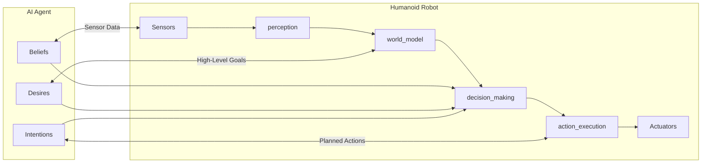

## Summary

This chapter delves into the fundamental concepts of AI agents and their pivotal role in enabling autonomous robotics systems. We will explore the architecture and design principles of AI agents, including their decision-making mechanisms, perception capabilities, and action planning. Through practical examples and real-world case studies, we will demonstrate how AI agents can be leveraged to endow robots with the intelligence and adaptability required for autonomous operation in complex environments. By the end of this chapter, you will have a comprehensive understanding of the synergies between AI agents and autonomous robotics, equipping you with the knowledge to design and implement advanced robotic systems.

## Learning Objectives

By the end of this chapter, you will be able to:

- Explain the key components and architectural design of AI agents for autonomous robotics
- Implement a ROS 2 node that utilizes a Belief-Desire-Intention (BDI) agent model to control a mobile robot
- Analyze the decision-making processes of an AI agent in response to dynamic environmental changes
- Evaluate the performance of an AI agent-based autonomous robotics system in a simulated environment
- Create a high-level system design for an AI agent-driven humanoid robot capable of navigation and object manipulation

## Prerequisites

- Familiarity with ROS 2 and Python programming
- Understanding of basic robotics concepts, such as sensors, actuators, and control systems
- Exposure to fundamental AI techniques, including machine learning and decision-making algorithms

## Main Content

### Introduction to AI Agents for Autonomous Robotics

AI agents are software entities that possess the ability to perceive their environment, reason about their observations, and take actions to achieve their goals. In the context of autonomous robotics, AI agents play a crucial role in endowing robots with the intelligence and adaptability required for independent operation in complex, dynamic environments.

The key components of an AI agent for autonomous robotics include:

1. **Perception**: The agent's ability to sense and interpret its surroundings, often through the integration of various sensors (e.g., cameras, LiDAR, IMU).
2. **Reasoning**: The agent's decision-making mechanisms, which can be based on techniques such as rule-based systems, planning algorithms, or machine learning models.
3. **Action**: The agent's capacity to execute appropriate actions, such as navigation, object manipulation, or communication, through the robot's actuators and control systems.

:::note
The integration of these components into a cohesive and adaptive system is a fundamental challenge in the design of AI agents for autonomous robotics.
:::

### Belief-Desire-Intention (BDI) Agent Model

One widely adopted architectural model for AI agents in autonomous robotics is the Belief-Desire-Intention (BDI) model. This model captures the key mental states of an agent and how they influence its decision-making and actions.

1. **Beliefs**: The agent's understanding of the current state of the world, based on its perception and knowledge.
2. **Desires**: The agent's goals or objectives, which drive its decision-making and actions.
3. **Intentions**: The agent's commitment to a course of action, based on its beliefs and desires, which guides its behavior.

The BDI agent model provides a structured approach to designing AI agents that can reason about their environment, set appropriate goals, and execute actions to achieve those goals. This model has been widely used in the development of autonomous robotic systems, as it aligns well with the cognitive processes required for decision-making and adaptive behavior.

:::tip
To illustrate the BDI agent model in action, let's consider a simple example of a mobile robot navigating through an unknown environment:

```python
import rclpy
from rclpy.node import Node
from geometry_msgs.msg import Twist
from sensor_msgs.msg import LaserScan

class BDIAgent(Node):
    def __init__(self):
        super().__init__('bdi_agent')
        self.publisher = self.create_publisher(Twist, 'cmd_vel', 10)
        self.subscription = self.create_subscription(
            LaserScan, 'scan', self.scan_callback, 10)

        # Beliefs
        self.obstacles = []
        self.robot_pose = [0, 0, 0]

        # Desires
        self.goal_pose = [5, 5, 0]

        # Intentions
        self.current_plan = []

    def scan_callback(self, msg):
        # Update the agent's beliefs based on the sensor data
        self.obstacles = self.process_laser_scan(msg)

    def process_laser_scan(self, scan_msg):
        # Implement logic to detect obstacles from the laser scan data
        return [...]

    def plan_path(self):
        # Implement path planning algorithm to generate a plan to reach the goal
        self.current_plan = [...]

    def execute_plan(self):
        # Implement logic to execute the current plan by publishing velocity commands
        twist = Twist()
        # Set twist values based on the current plan
        self.publisher.publish(twist)

    def run(self):
        while not self.is_at_goal():
            self.plan_path()
            self.execute_plan()

    def is_at_goal(self):
        # Implement logic to check if the robot has reached the goal
        return False

def main(args=None):
    rclpy.init(args=args)
    agent = BDIAgent()
    agent.run()
    rclpy.shutdown()

if __name__ == '__main__':
    main()

In this example, the `BDIAgent` class represents an AI agent that uses the BDI model to control a mobile robot. The agent has beliefs about its environment (obstacles and robot pose), desires (reaching a goal pose), and intentions (the current plan to reach the goal). The agent continuously updates its beliefs, plans a path, and executes the plan to navigate towards the goal.
```
:::

### Integrating AI Agents with Robotic Platforms

Integrating AI agents with robotic platforms requires careful design and implementation to ensure seamless interaction and effective decision-making. This typically involves the following steps:

1. **Sensor Integration**: Connecting the agent's perception capabilities with the robot's sensors, such as cameras, LiDAR, and IMU, to gather information about the environment.
2. **World Modeling**: Constructing an internal representation of the robot's surroundings, including the detection and tracking of objects, obstacles, and other relevant entities.
3. **Decision-Making**: Implementing the agent's reasoning mechanisms, such as planning algorithms, rule-based systems, or machine learning models, to determine the appropriate actions based on the agent's beliefs, desires, and intentions.
4. **Action Execution**: Translating the agent's decisions into specific control commands for the robot's actuators, enabling the execution of actions like navigation, manipulation, or communication.

:::note
To illustrate the integration of an AI agent with a robotic platform, we can consider the example of a humanoid robot equipped with a BDI agent for autonomous navigation and object manipulation.
:::



In this architecture, the AI agent's beliefs, desires, and intentions are tightly integrated with the robot's perception, world modeling, decision-making, and action execution components. The agent's reasoning processes leverage the sensor data and world model to determine the appropriate actions, which are then executed by the robot's actuators.

### Advanced AI Agents for Autonomous Robotics

As the field of autonomous robotics continues to evolve, researchers and developers are exploring more advanced AI agent architectures and techniques to enhance the capabilities of robotic systems. Some of these include:

1. **Hierarchical Agent Architectures**: Designing AI agents with multiple levels of abstraction, where higher-level agents manage strategic decision-making, and lower-level agents handle specific tasks or behaviors.
2. **Multi-Agent Cooperation**: Enabling multiple AI agents to collaborate and coordinate their actions to achieve shared goals or solve complex problems.
3. **Learning and Adaptation**: Incorporating machine learning algorithms into AI agents to allow them to learn from experience and adapt their behavior to changing environments or user preferences.
4. **Ethical Reasoning**: Developing AI agents with the ability to reason about moral and ethical considerations, ensuring that their actions align with human values and principles.

By leveraging these advanced AI agent techniques, researchers and developers can create increasingly sophisticated autonomous robotics systems capable of operating in complex, dynamic environments and collaborating with humans in meaningful and beneficial ways.

## Key Takeaways

- AI agents are software entities that can perceive their environment, reason about their observations, and take actions to achieve their goals.
- The Belief-Desire-Intention (BDI) agent model provides a structured approach to designing AI agents for autonomous robotics, capturing the key mental states that influence decision-making and actions.
- Integrating AI agents with robotic platforms requires careful design and implementation to ensure seamless interaction and effective decision-making, involving sensor integration, world modeling, decision-making, and action execution.
- Advanced AI agent architectures, such as hierarchical structures, multi-agent cooperation, learning and adaptation, and ethical reasoning, are being explored to enhance the capabilities of autonomous robotics systems.

## Glossary

1. **AI Agent**: A software entity that can perceive its environment, reason about its observations, and take actions to achieve its goals.
2. **Belief-Desire-Intention (BDI) Model**: An architectural model for AI agents that captures their key mental states (beliefs, desires, and intentions) and how they influence decision-making and actions.
3. **Perception**: The AI agent's ability to sense and interpret its surroundings, often through the integration of various sensors.
4. **Reasoning**: The AI agent's decision-making mechanisms, which can be based on techniques such as rule-based systems, planning algorithms, or machine learning models.
5. **Action**: The AI agent's capacity to execute appropriate actions, such as navigation, object manipulation, or communication, through the robot's actuators and control systems.
6. **World Modeling**: The process of constructing an internal representation of the robot's surroundings, including the detection and tracking of objects, obstacles, and other relevant entities.
7. **Hierarchical Agent Architecture**: A multi-level agent architecture where higher-level agents manage strategic decision-making, and lower-level agents handle specific tasks or behaviors.
8. **Multi-Agent Cooperation**: The ability of multiple AI agents to collaborate and coordinate their actions to achieve shared goals or solve complex problems.
9. **Learning and Adaptation**: The incorporation of machine learning algorithms into AI agents to allow them to learn from experience and adapt their behavior to changing environments or user preferences.
10. **Ethical Reasoning**: The ability of AI agents to reason about moral and ethical considerations, ensuring that their actions align with human values and principles.

## Review Questions

1. Explain the key components of an AI agent for autonomous robotics and how they contribute to the agent's decision-making and action execution.
2. Describe the Belief-Desire-Intention (BDI) agent model and how it can be applied to the design of autonomous robotic systems.
3. Outline the steps involved in integrating an AI agent with a robotic platform, highlighting the importance of each step.
4. Discuss the potential benefits and challenges of incorporating advanced AI agent architectures, such as hierarchical structures or multi-agent cooperation, in autonomous robotics.
5. Explain the role of ethical reasoning in the design of AI agents for autonomous robotics and the considerations that should be taken into account.