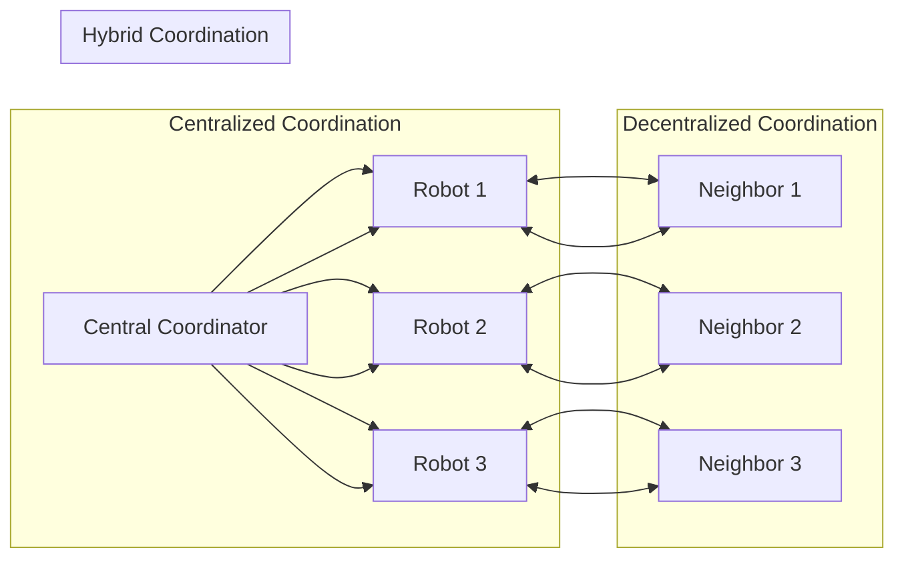
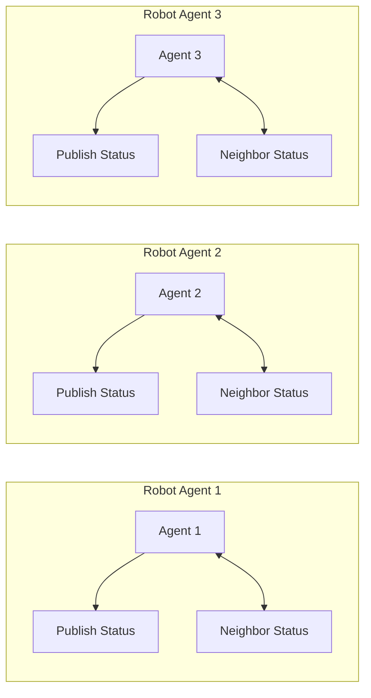

## Summary

This chapter delves into the fundamental concepts and practical applications of multi-agent coordination in the field of robotics. You will learn about the key challenges, algorithms, and architectures involved in enabling multiple robotic agents to work together effectively to accomplish tasks that would be difficult or impossible for a single agent. Through real-world examples and hands-on code exercises, you will gain a deep understanding of how to design, implement, and evaluate multi-agent robotic systems for a variety of applications, from warehouse automation to search and rescue operations.

## Learning Objectives

By the end of this chapter, you will be able to:

- Explain the importance of multi-agent coordination in advanced robotic systems
- Analyze the key factors that influence the design of multi-agent robotic architectures
- Implement a ROS 2 system for coordinating the actions of multiple robots using a decentralized approach
- Evaluate the performance of a multi-agent robotic system in a simulated environment
- Create a plan for deploying a multi-agent robotic system to solve a complex, real-world problem

## Prerequisites

- Familiarity with ROS 2 and Python programming
- Understanding of basic robotic control and navigation concepts
- Exposure to single-agent robotic systems and their limitations

## Multi-Agent Coordination in Robotics

### The Need for Multi-Agent Coordination

In many real-world scenarios, the capabilities of a single robotic agent may be insufficient to tackle complex tasks. This is where multi-agent coordination becomes a crucial aspect of advanced robotic systems. By leveraging the collective abilities of multiple robots, we can achieve higher levels of efficiency, flexibility, and resilience in areas such as:

- Large-scale warehouse automation
- Coordinated search and rescue operations
- Distributed environmental monitoring
- Multi-robot construction and assembly

### Challenges in Multi-Agent Coordination

Coordinating the actions of multiple robotic agents introduces a unique set of challenges, including:

1. **Decentralized Decision-Making**: Robots must make decisions based on local information and limited communication, requiring robust algorithms for consensus and conflict resolution.
2. **Dynamic Task Allocation**: Agents must dynamically allocate tasks and resources to adapt to changing environments and priorities.
3. **Communication and Sensing Limitations**: Robots may have restricted communication ranges and imperfect sensing capabilities, necessitating robust coordination strategies.
4. **Scalability and Robustness**: The coordination system must be able to scale to large numbers of agents and remain resilient to individual agent failures.

### Architectures for Multi-Agent Coordination

There are several approaches to organizing the coordination of multiple robotic agents, each with its own advantages and trade-offs:

1. **Centralized Coordination**: A central control unit manages the decision-making and task allocation for all agents. This approach can provide optimal solutions but may suffer from single points of failure and scalability issues.

2. **Decentralized Coordination**: Agents make decisions autonomously based on local information and limited communication with their neighbors. This approach is more scalable and robust but may result in suboptimal solutions.

3. **Hybrid Coordination**: A combination of centralized and decentralized approaches, where a central coordinator provides high-level guidance while agents make local decisions. This can balance optimality and scalability.

:::note Mermaid Diagram

:::

## Implementing Multi-Agent Coordination with ROS 2

### Decentralized Coordination using ROS 2

In this section, we'll explore a decentralized approach to multi-agent coordination using ROS 2. We'll create a system where each robot agent makes decisions based on local information and limited communication with its neighbors.

:::tip Code Example
```python
import rclpy
from rclpy.node import Node
from std_msgs.msg import String

class RobotAgent(Node):
    def __init__(self, name):
        super().__init__(name)
        self.publisher = self.create_publisher(String, 'agent_status', 10)
        self.subscription = self.create_subscription(
            String, 'neighbor_status', self.neighbor_callback, 10)
        self.timer = self.create_timer(1.0, self.publish_status)
        self.get_logger().info(f'Robot agent {name} initialized')

    def neighbor_callback(self, msg):
        self.get_logger().info(f'Received message from neighbor: {msg.data}')
        # Process neighbor's status and update own decision-making

    def publish_status(self):
        msg = String()
        msg.data = f'Robot agent {self.get_name()} reporting status'
        self.publisher.publish(msg)

def main(args=None):
    rclpy.init(args=args)

    agent1 = RobotAgent('agent1')
    agent2 = RobotAgent('agent2')
    agent3 = RobotAgent('agent3')

    rclpy.spin(agent1)
    rclpy.spin(agent2)
    rclpy.spin(agent3)

    rclpy.shutdown()

if __name__ == '__main__':
    main()
```
:::

In this example, each robot agent is represented by a `RobotAgent` class that publishes its own status and subscribes to the status of its neighbors. The agents make decisions based on the information received from their neighbors, demonstrating a decentralized coordination approach.

:::note Mermaid Diagram

:::

### Evaluating Multi-Agent Performance

To evaluate the performance of the multi-agent robotic system, we can set up a simulation environment and measure metrics such as task completion time, energy efficiency, and coordination quality. ROS 2 provides tools like Gazebo and MoveIt! that can be used to create realistic simulations and test the coordination algorithms.

:::warning Simulation Setup
Ensure that the simulation environment accurately reflects the real-world constraints and requirements of the multi-agent robotic system. This includes factors like sensor accuracy, communication range, and environmental obstacles.
:::

## Key Takeaways

- Multi-agent coordination is crucial for advanced robotic systems to tackle complex tasks that are beyond the capabilities of a single agent.
- Key challenges in multi-agent coordination include decentralized decision-making, dynamic task allocation, communication and sensing limitations, and scalability.
- There are different architectural approaches to multi-agent coordination, including centralized, decentralized, and hybrid models, each with its own trade-offs.
- Implementing a decentralized multi-agent coordination system using ROS 2 involves having each agent make decisions based on local information and limited communication with neighbors.
- Evaluating the performance of a multi-agent robotic system requires setting up a realistic simulation environment and measuring relevant metrics.

## Glossary

1. **Multi-Agent Coordination**: The process of enabling multiple robotic agents to work together effectively to accomplish complex tasks.
2. **Decentralized Decision-Making**: A coordination approach where each agent makes decisions autonomously based on local information and limited communication.
3. **Dynamic Task Allocation**: The process of dynamically assigning tasks and resources to robotic agents to adapt to changing environments and priorities.
4. **Communication and Sensing Limitations**: Constraints on the ability of robots to communicate and sense their surroundings, which must be accounted for in coordination strategies.
5. **Centralized Coordination**: A coordination approach where a central control unit manages the decision-making and task allocation for all agents.
6. **Decentralized Coordination**: A coordination approach where agents make decisions autonomously based on local information and limited communication with their neighbors.
7. **Hybrid Coordination**: A combination of centralized and decentralized approaches, where a central coordinator provides high-level guidance while agents make local decisions.

## Review Questions

1. Explain the key advantages and disadvantages of a decentralized approach to multi-agent coordination compared to a centralized approach.
2. Describe the main challenges involved in designing a scalable and robust multi-agent robotic system.
3. How can the performance of a multi-agent robotic system be evaluated in a simulated environment? What metrics would you consider important to measure?
4. Implement a ROS 2 node that demonstrates the basic functionality of a decentralized multi-agent coordination system, including publishing status updates and subscribing to neighbor status.
5. Propose a plan for deploying a multi-agent robotic system to solve a complex, real-world problem of your choice. Discuss the key design considerations and coordination strategies you would employ.