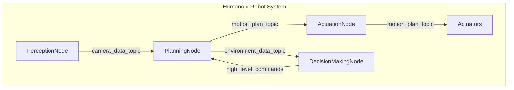

## Summary

This chapter guides you through the development of a complete humanoid robotics system as a final capstone project. You will integrate all the concepts and technologies covered throughout the course to build a fully functional humanoid robot that can navigate, perceive its environment, and interact with objects and people. This hands-on project will challenge you to apply your knowledge of robot kinematics, control, perception, planning, and high-level decision making in a cohesive system.

## Learning Objectives

By the end of this chapter, you will be able to:

- Analyze the architectural requirements for a complete humanoid robotics system
- Implement a ROS 2 node-based framework to coordinate the various subsystems of the humanoid robot
- Evaluate the performance of the integrated humanoid system and identify areas for improvement
- Create a detailed project report and presentation showcasing the final capstone humanoid robot

## Prerequisites

- Proficiency in Python programming and ROS 2 development
- Understanding of robot kinematics, dynamics, and control (covered in previous chapters)
- Knowledge of robot perception techniques, including computer vision and sensor fusion (covered in previous chapters)
- Familiarity with robot planning and decision-making algorithms (covered in previous chapters)

## Main Content

### Architectural Design of a Humanoid Robotics System

The development of a complete humanoid robotics system requires the integration of various subsystems, including:

1. **Mechanical Design**: The mechanical structure of the humanoid robot, including the limbs, torso, and head.
2. **Actuation and Control**: The servo motors, drivers, and control algorithms that enable the robot to move and maintain balance.
3. **Perception**: The sensors (cameras, IMUs, force/torque sensors, etc.) and computer vision/sensor fusion algorithms that allow the robot to perceive its environment.
4. **Planning and Navigation**: The algorithms that enable the robot to plan its movements, navigate through its environment, and avoid obstacles.
5. **High-Level Decision Making**: The AI-powered decision-making processes that allow the robot to understand its goals, make appropriate choices, and interact with humans and objects.

:::note
A well-designed humanoid robotics system should have a modular, node-based architecture that allows for easy integration and scalability of the various subsystems.
:::

### Implementing a ROS 2 Framework for the Humanoid Robot

To bring all the subsystems together, we will use a ROS 2-based framework. ROS 2 provides a robust and flexible platform for developing complex robotic systems, with features like:

- Modular, node-based architecture
- Efficient communication between nodes using the publish-subscribe model
- Standardized interfaces for sensors, actuators, and other components
- Tools for simulation, visualization, and debugging

Here's an example of how you might structure the ROS 2 nodes for a humanoid robot:

```python
# humanoid_robot_node.py
import rclpy
from rclpy.node import Node

from .actuation_node import ActuationNode
from .perception_node import PerceptionNode
from .planning_node import PlanningNode
from .decision_making_node import DecisionMakingNode

class HumanoidRobotNode(Node):
    def __init__(self):
        super().__init__('humanoid_robot')

        self.actuation_node = ActuationNode(self)
        self.perception_node = PerceptionNode(self)
        self.planning_node = PlanningNode(self)
        self.decision_making_node = DecisionMakingNode(self)

        # Interconnect the nodes using ROS 2 topics and services
        self.perception_node.camera_data_topic.connect(self.planning_node.camera_data_topic)
        self.planning_node.motion_plan_topic.connect(self.actuation_node.motion_plan_topic)
        # Add more interconnections as needed

def main(args=None):
    rclpy.init(args=args)
    node = HumanoidRobotNode()
    rclpy.spin(node)
    rclpy.shutdown()

```
:::tip
Use Mermaid diagrams to visualize the high-level architecture of your humanoid robotics system, including the interconnections between the various ROS 2 nodes.
:::



### Integrating the Subsystems

With the ROS 2 framework in place, you can now integrate the various subsystems of the humanoid robot:

1. **Mechanical Design and Actuation**: Implement the kinematic and dynamic models of the humanoid robot, and design the control algorithms to actuate the robot's joints and maintain balance.
2. **Perception**: Integrate the robot's sensors (cameras, IMUs, force/torque sensors, etc.) and develop computer vision and sensor fusion algorithms to perceive the environment and detect objects, people, and obstacles.
3. **Planning and Navigation**: Implement path planning and obstacle avoidance algorithms to enable the humanoid robot to navigate through its environment and reach desired goals.
4. **High-Level Decision Making**: Develop the AI-powered decision-making processes that allow the robot to understand its objectives, make appropriate choices, and interact with humans and objects in a natural and intuitive way.

:::warning
Ensure that all the subsystems are well-integrated and that the overall system is robust, reliable, and responsive to changes in the environment and user inputs.
:::

### Evaluating and Optimizing the Humanoid Robotics System

Throughout the development process, continuously evaluate the performance of the integrated humanoid robotics system. Identify areas for improvement, such as:

- Accuracy and responsiveness of the robot's movements and navigation
- Reliability and robustness of the perception and decision-making algorithms
- Efficiency and scalability of the overall system architecture

Use the insights gained from the evaluation to optimize the system, refine the algorithms, and improve the overall user experience.

## Key Takeaways

- Developing a complete humanoid robotics system requires the integration of various subsystems, including mechanical design, actuation and control, perception, planning and navigation, and high-level decision making.
- Using a ROS 2-based framework can provide a modular, scalable, and flexible platform for building complex robotic systems.
- Continuous evaluation and optimization of the integrated system is crucial to ensure its reliability, responsiveness, and overall performance.
- The final capstone project challenges you to apply the knowledge and skills you've gained throughout the course to create a fully functional humanoid robot.

## Glossary

1. **Humanoid Robotics**: The field of robotics focused on the development of robots that resemble and behave like humans, with a similar body structure and range of motion.
2. **Modular Architecture**: A design approach that divides a system into smaller, interchangeable modules, each with a specific function, to improve flexibility, scalability, and maintainability.
3. **Sensor Fusion**: The process of combining data from multiple sensors to produce more accurate and reliable information about the environment or the system's state.
4. **Path Planning**: The algorithms and techniques used to determine the optimal path for a robot to reach a desired goal while avoiding obstacles and constraints.
5. **High-Level Decision Making**: The AI-powered processes that enable a robot to understand its objectives, assess the current situation, and make appropriate decisions to achieve its goals.

## Review Questions

1. Explain the key subsystems that need to be integrated to create a complete humanoid robotics system.
2. Describe the benefits of using a ROS 2-based framework for developing a humanoid robot, and discuss the main components of the example ROS 2 architecture presented in the chapter.
3. Discuss the importance of continuous evaluation and optimization in the development of a humanoid robotics system. Provide examples of areas that might require optimization.